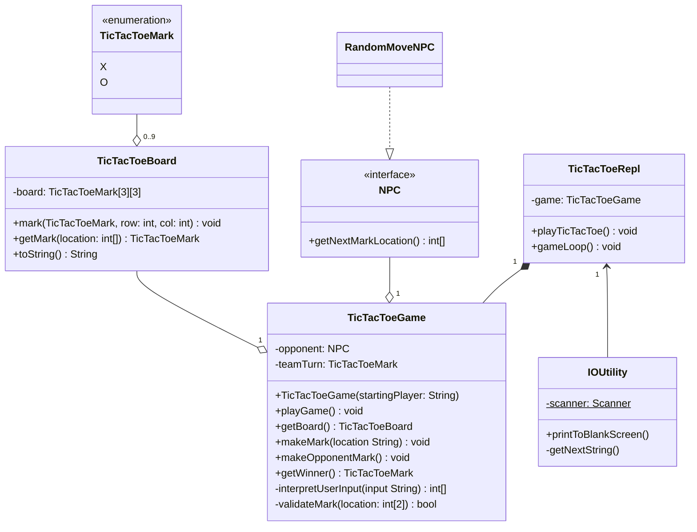
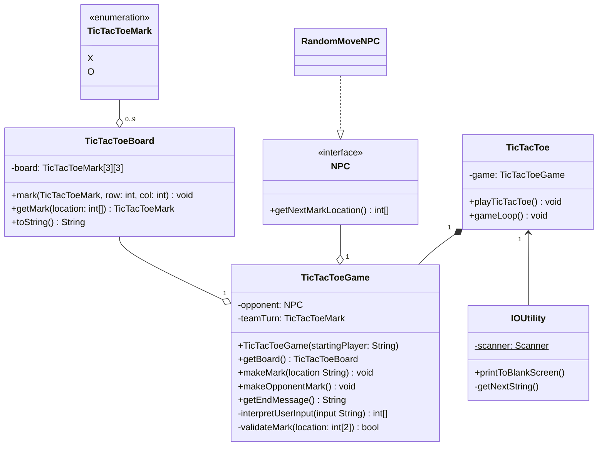

# OIT Code Challenge

## Overview

This project allows a player to play a game of "Tic-Tac-Toe" against a computer.

## Installation

Follow these instructions to build the project on your local machine. Alternatively, use the release build provided.

### Prerequisites:

#### Maven

This project is built with [Apache Maven](https://maven.apache.org/guides/getting-started/maven-in-five-minutes.html),
so install that if you haven't already. Verify installation with `mvn --version` on Windows.

#### Java Runtime Environment

This is a java project which builds to a `.jar` file, so you'll need to have
the [Java Runtime Environment](https://www.oracle.com/java/technologies/downloads/) installed. Verify installation
with `java --version` on Windows.

Once you have all prerequisites installed, run the following commands to install and build the project:

```bash
# Clone the repository to your machine
git clone https://github.com/llamathedark/tic-tac-toe.git

# Navigate into the project directory
cd tic-tac-toe

# Build project using maven
mvn package

# Run generated .jar file
java -cp target\tic-tac-toe-1.0.0.jar tic-tac-toe.Main
```

Alternatively, navigate into `tic-tac-toe\target` and run:

```bash
java -jar tic-tac-toe-1.0.0.jar
```

## Dependencies

### JUnit

Junit is used for creating and running unit-tests for the project.


---

## Process

### Understanding the Problem

The goal is to have a working Tic-Tac-Toe game playable against a computer. Some questions to consider:

* What will be used to build the UI?
* How will the computer decide which moves to make?
* Which programming language should be used?

### Planning the Solution

* I'll use a terminal based UI
* For now, I'll just have the computer choose moves randomly and see how much time I have left to implement something
  more complicated.
* I think an object-oriented approach would most easily transfer the idea of this game into code, so I'll use something
  like Java or C++.

### Designing the Solution

Taking an object-oriented approach, I begin with a UML diagram of classes:



* I considered using ANSI characters to style the tic-tac-toe board, but seeing as the project must be suitable for
  Windows, I decided against it.

With the UML diagram complete, it was time to start implementing it. I'll start by creating all the classes, and then
creating unit tests for key methods in each class. I'll use JUnit for the tests.

As I was implementing the design, I made some key changes that I saw were not realistic or that would not represent the
best implementation. These were mainly:

| Change                                                           | Purpose                                                                                                                                                                                      |
|------------------------------------------------------------------|----------------------------------------------------------------------------------------------------------------------------------------------------------------------------------------------|
| Remove `playGame()` from `TicTacToeGame`                         | This was to be implemented by `TicTacToeRepl`                                                                                                                                                |
| Change `getWinner(): TicTacToeMark` to `getEndMessage(): String` | This was to reduce the number of classes that need to know about the use of the `TicTacToeMark` enumeration. It also accounts for the fact that there is not always a winner in Tic-Tac-Toe. |
| Rename `TicTacToeRepl` to just `TicTacToe`                       | I think this is a more readable and accurate name.                                                                                                                                           |

The updated class diagram looks like this:


